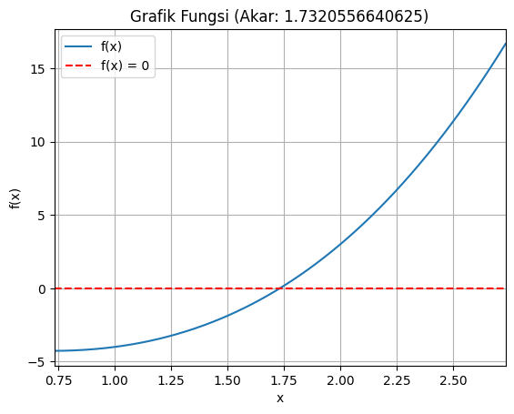

# Komputasi Numerik Kelompok 3
## Kelas Komputasi Numerik D

*   Amanda Illona Farrel (5025221056)
*   Hilmi Fawwaz Sa'ad   (5025221103)
*   Ricardo Supriyanto   (5025221218)

### Soal 
Anda sudah mengerti algoritma pemrosesan metode Bolzano, dan anda sudah memahami cara kerjanya. Sekarang anda tinggal mengimplementasikan algoritma tersebut menjadi sebuah program komputer metode Bolzano (yang dapat menampilkan proses iteratif numerik, lengkap dengan grafik fungsinya).

### Input
- Fungsi `f(x) = x^3 + x^2 - 3x - 3`
- x0 = 1
- x1 = 2
- Jumlah iterasi = 20

### Output
f(x) = x^3 + x^2 - 3x - 3

Masukkan x0: 1

Masukkan x1: 2

Jumlah iterasi: 20

-------------------------------------------------------
		     METODE BOLZANO

iterasi | x0    | x1    | xt    | f(x0)  | f(x1) | f(xt)
--------|-------|-------|-------|--------|-------|-----
1	    | 1.000 | 2.000 | 1.500	| -4.000 | 3.000 | -1.875
2	    | 1.500 | 2.000	| 1.750	| -1.875 | 3.000 | 0.172
3	    | 1.500 | 1.750	| 1.625	| -1.875 | 0.172 | -0.943
4	    | 1.625 | 1.750	| 1.688	| -0.943 | 0.172 | -0.409
5	    | 1.688 | 1.750	| 1.719	| -0.409 | 0.172 | -0.125
6	    | 1.719 | 1.750	| 1.734	| -0.125 | 0.172 | 0.022
7	    | 1.719 | 1.734	| 1.727	| -0.125 | 0.022 | -0.052
8	    | 1.727	| 1.734	| 1.730	| -0.052 | 0.022 | -0.015
9	    | 1.730	| 1.734	| 1.732	| -0.015 | 0.022 | 0.004
10	    | 1.730	| 1.732	| 1.731	| -0.015 | 0.004 | -0.006
11	    | 1.731	| 1.732	| 1.732	| -0.006 | 0.004 | -0.001
12	    | 1.732	| 1.732	| 1.732	| -0.001 | 0.004 | 0.001
13	    | 1.732	| 1.732	| 1.732	| -0.001 | 0.001 | 0.000

Akar ditemukan pada iterasi 13

Akar bernilai =  1.7320556640625

------------------------------------------------------- 
